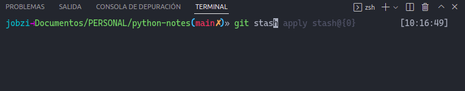

# Bash and Zsh

## Contributors

- [Daniela Garcia](https://github.com/dsgarcia8)
- [Jipson Murillo](https://github.com/Jobzi)
- [Josue Cando](https://github.com/JosueOb)
- [Jean Pierre Alvarado](https://github.com/PieritoAlva95)
- [Joseph Guerrero](https://github.com/JuanJosephG)

## Content

- [Introduction](#introduction)
- [Features comparison](#features-comparison)
- [Internet search volume](#internet-search-volume)
- [How to install and set up Zsh as default](#how-to-install-and-set-up-zsh-as-default)
- [Zsh Customization](#zsh-customization)
    - [OhMyZsh](#ohmyzsh)
        - [Installation](#installation)
        - [Themes](#themes)
        - [Plugins](#plugins)
            - [zsh-autosuggestions](#zsh-autosuggestions)
            - [Top Plugins Here](#top-plugins-here)
        - [Favorite Zsh features](#favorite-zsh-features)
            - [Help with Git](#help-with-git)
            - [Tab completion on ‘cd’](#tab-completion-on-cd)
            - [See More Features Here](#see-more-features-here)
            - [Personal Experience](#personal-experience)
    - [Powerlevel10k](#powerlevel10k)
        - [Powerlevel10k Themes](#powerlevel10k-themes)
        - [Personal Experience](#personal-experience-1)
    - [Oh My Posh](#oh-my-posh)
        - [Installation](#installation-1)
        - [Themes](#themes-1)
        - [Swap to another theme](#swap-to-another-theme)
        - [Personal Experience](#personal-experience-2)

## Introduction

Shell is a program that takes commands from the keyboard and gives them to the operating system to perform. In the old
days, it was the only user interface available on a Unix-like system such as Linux. Nowadays, we have graphical user
interfaces (GUIs) in addition to command line interfaces (
CLIs) such as the shell.

On most Linux systems a program called bash (which stands for Bourne Again SHell, an enhanced version of the original
Unix shell program, sh, written by Steve Bourne) acts as the shell program. Besides bash, there are other shell programs
available for other systems. These include: ksh, tcsh and zsh.

Check the difference about Terminal and Shell in the next video:

[](https://www.youtube.com/watch?v=Yt57-gg9jVg "Shell vs Terminal")

Check the following free course about Shell: [Udacity link](https://www.udacity.com/course/ud595)

- Bash is an acronym for Bourn Again Shell, a pun on the name Stephen Bourne, creator of one of Bash's predecessors. It
  is a shell program written by Brian Fox as an upgraded version of Bourne Shell program 'sh'. Bash operates not only on
  Linux, however; it's also available on macOS and BSD, and you can use it on Windows through Windows Subsystem for
  Linux.

- Zsh is one of them which was invented after Bash. It has many features like Bash but some features of Zsh make it
  better and improved than Bash, such as spelling correction, cd automation, better theme, and plugin support, etc. Zsh
  or Z shell is not installed in the system by default. The users need to install this shell to use it. It has features
  like interactive Tab completion, automated file searching, regex integration, advanced shorthand for defining command
  scope, and a rich theme engine.

## Features comparison

| Zsh                                                                                           | Bash                                                                          |
|-----------------------------------------------------------------------------------------------|-------------------------------------------------------------------------------|
| It contains a lot of advanced features.                                                       | It does not contain advanced features.                                        |
| Has a more complex configuration file structure.                                              | Configuration files structure is simple.                                      |
| Configuration and customization is provided by Oh My Zsh framework.                           | Configuration and customization is provided by Bash-it.                       |
| Commands history is shared across all shells.                                                 | History sharing is difficult.                                                 |
| Zsh scripts are not so widely used.                                                           | Bash scripts are widely used.                                                 |
| Zsh does not load SHELLOPTS during startup.                                                   | SHELLOPTS are loaded during the start.                                        |
| Environment configuration is more customizable with zshrc, zlogin, zshenv, zlogout, zprofile. | Environment is less customizable and can be implemented with a fewer scripts. |
| Allows using expanded aliases anywhere in the file.                                           | Bash does not support the expanded aliases by default.                        |
| zparseopts makes scripts arguments parsing very easy.                                         | Parsing script arguments with getopts is a bit more challenging.              |
| Terminal calculations can be done using zcalc.                                                | You need to use two external calculators: bc and expr.                        |
| Terminal configuration/autostart scripts are loaded from ~/.zshrc file.                       | Terminal configuration/autostart scripts are loaded from ~/.bashrc file.      |
| bindkey is used for keys binding.                                                             | bind builtin and ~/.inputrc are used for key binding.                         |
| More options to build fancy prompts.                                                          | Less options for fancy prompts.                                               |
| setopt responsible for shell settings.                                                        | shopt configures shell settings.                                              |
| # is not considered a comment unless INTERACTIVE_COMMENTS is set.                             | # represents a comment string.                                                |
| Extended wildcard patterns enabled by default.                                                | Use shopt -s extglob to enable extended wildcard patterns.                    |
| More ways to transform the variable value (parameter expansion).                              | Fewer methods for transforming variables.                                     |
| Has auto completion and spellings correction features embedded.                               | You need to use bash-completion package.                                      |
| More plugins and themes available.                                                            | Fewer plugins and themes available.                                           |
| Zsh is more customizable.                                                                     | Bash is less customizable.                                                    |
| POSIX compatible if emulate sh has been set.                                                  | Follow POSIX standards if --posix command-line option was set.                |
| Auto completion works faster.                                                                 | Auto completion is slower.                                                    |
| Smaller community                                                                             | Wider community                                                               |

## Internet search volume

Here's a Google Trends [chart](https://trends.google.com/trends/explore?q=ZSH,%2Fm%2F01g7l), which show the search
volume comparison for both shells:


## How to install and set up Zsh as default

Installation on many platforms and setting up Zsh as default you can
find [here](https://github.com/ohmyzsh/ohmyzsh/wiki/Installing-ZSH#install-and-set-up-zsh-as-default)
.

## Zsh Customization

Within our profession as software developers is important the speed and simplicity of everyday tasks and one of those is
the use of the terminal, the terminal we use all day and for virtually everything, so we require a terminal that we can
customize to accommodate and obviously simplify everything we can.

As mentioned before, ZSH (Z shell) is a terminal (or rather shell) for interactive use that will allow us to be more
efficient when we are in front of the console. This shell allows us to interpret, in addition to commands, scripts which
can become extremely useful.

Listed below are some customizations/settings that you can use:

### OhMyZsh



Oh My Zsh is a delightful, open source, community-driven framework for managing your Zsh configuration. It comes bundled
with thousands of helpful functions, helpers, plugins, themes, and a few things that make you shout...

["Oh My ZSH!"](https://ohmyz.sh)

#### Installation

- Windows: [Windows Installation](https://medium.com/fixtergeek/instalar-oh-my-zsh-en-windows-93e554938fd2)

- MacOS: [masOS Installation](https://ohmyz.sh/#install)
- Linux: [Linux Installation](https://es.linux-console.net/?p=24)

#### Themes

First we start from the themes, ZSH provides a variety of themes that can be viewed in the official repository
of [Themes - OhMyZsh](https://github.com/ohmyzsh/ohmyzsh/wiki/Themes).

To open the configuration file you can use `vim` or `nano` in my case, I used nano to edit the configuration
file `.zshrc`.

```terminal
nano ~/.zshrc
```

In order to enable a theme, set ZSH_THEME to the name of the theme in your ~/.zshrc, before sourcing Oh My Zsh; for
example: ZSH_THEME=robbyrussell If you do not want any theme enabled, just set ZSH_THEME to blank: ZSH_THEME=""
or you can select from the list of themes provided by the GitHub repository.

#### Plugins

To install plugins, the OhMyZsh repository has a list of plugins that can be added to the terminal. You can check the
list here [Plugins](https://github.com/ohmyzsh/ohmyzsh/wiki/Plugins).

Enable a plugin by adding its name to the plugins array in your .zshrc file (found in the $HOME directory). For example,
this enables the `rails`, `git` and `ruby` plugins, in that order:

```sh
plugins=(rails git ruby)
```

> **NOTE**: Elements in zsh arrays are separated by whitespace (spaces, tabs, newlines...). DO NOT use commas.

##### zsh-autosuggestions

1. Clone this repository into `$ZSH_CUSTOM/plugins` (by default `~/.oh-my-zsh/custom/plugins`)

    ```sh
    git clone https://github.com/zsh-users/zsh-autosuggestions ${ZSH_CUSTOM:-~/.oh-my-zsh/custom}/plugins/zsh-autosuggestions
    ```

2. Add the plugin to the list of plugins for Oh My Zsh to load (inside `~/.zshrc`):

    ```zsh
    plugins=( 
        # other plugins...
        zsh-autosuggestions
    )
    ```

3. Start a new terminal session.

##### Top Plugins Here

- [Plugins - OhMyZsh](https://safjan.com/top-popular-zsh-plugins-on-github/)

#### Favorite Zsh features

##### Help with Git

> Everyone has their favourite aliases for git commands. oh-my-zsh has a bunch out of the box too.


##### Tab completion on ‘cd’

> In Bash when you press `<TAB>` you get prompted with a list of files in the current directory. In the context of the cd command this isn’t particularly useful, as you can only go into directories. Zsh knows this and only shows you the possible valid destinations.


##### See More Features Here

- [Features](https://code.joejag.com/2014/why-zsh.html)

##### Personal Experience

> As a developer I have spent most of my time using GitBash on Windows. However being on the WP team I opted to switch operating systems to Ubuntu, I installed OhMyZsh on recommendations and suggestions. I have been using the zsh terminal and thanks to plugins like zsh-autosuggestions, when typing the command in the terminal it shows me suggestions and thus saves me time in searching for the command and pasting it. The features I use the most are the Git Aliases to avoid typing all the git commands just put aliases to facilitate the work of versioning code.

### Powerlevel10k


Powerlevel10k, is a **theme** for zsh which stands out a lot for its appearance and that adds value (speed, flexibility
and out-of-the-box experience) with data that can often be interesting that you can read in
their [documentation](https://github.com/romkatv/powerlevel10k#readme) within which you can highlight:

- Script execution time
- Git status
- Command time

In order to install this theme on your zsh terminal, follow the next 4 steps:

1. Install the [recommended font](https://github.com/romkatv/powerlevel10k#meslo-nerd-font-patched-for-powerlevel10k)
   .
2. Install [Powerlevel 10k](https://github.com/romkatv/powerlevel10k#installation) itself.
3. Restart Zsh with `exec zsh` or by closing the current terminal and opening a new one.
4. Type `p10k configure` if the configuration wizard doesn't start automatically.

#### Powerlevel10k Themes

Run the following command: `p10k configure` to be able to configure the desired theme. And a configuration wizard will
appear where we will give the styles and the configurations that we want (
see the image).


In addition, this command will allow you to configure Powerlevel10k as many times as you want.

#### Personal Experience

> Within our profession as developers is important the speed and simplicity of daily tasks and one of those is the use of the terminal, the terminal I use all day and for practically everything, so I require a terminal that I can customize to accommodate and obviously simplify my work as much as possible.

### Oh My Posh

> Oh My Posh is a custom prompt engine for any shell that has the ability to adjust the prompt string with a function or variable. This engine allows you to customize any shell and offers many themes that can be used. It can be installed on Windows, MacOS and Linux.

The [documentation](https://ohmyposh.dev) details what Oh My Posh offers and if you don’t want to use an existing theme
you can create a custom theme.


#### Installation

It is recommended to follow the OH MY POSH documentation step by step.

- Windows: [Windows Installation](https://ohmyposh.dev/docs/windows)
- MacOS: [masOS Installation](https://ohmyposh.dev/docs/macos)
- Linux: [Linux Installation](https://ohmyposh.dev/docs/linux)

#### Themes

Oh my posh offers many themes out of the box. In this link you can see the screenshot of
the [most common themes](https://ohmyposh.dev/docs/themes) and in case you want to see the entire catalog of themes you
can access the [github repository](https://github.com/JanDeDobbeleer/oh-my-posh/tree/main/themes)

These are some of my personal favorite themes because of their simplicity.

- avit theme  
  Download json [here](https://github.com/JanDeDobbeleer/oh-my-posh/blob/main/themes/avit.omp.json)
  

- amro theme  
  Download json [here](https://github.com/JanDeDobbeleer/oh-my-posh/blob/main/themes/amro.omp.json)
  

#### Swap to another theme

If you want to change your theme, just download the json file, make sure you have it in your `$HOME`
folder and follow the steps to replace your existing prompt according to your operating system.

- Windows: [Replace your existing prompt in Windows](https://ohmyposh.dev/docs/windows#replace-your-existing-prompt)
- MacOS: [Replace your existing prompt in masOS](https://ohmyposh.dev/docs/macos#replace-your-existing-prompt)
- Linux: [Replace your existing prompt in Linux](https://ohmyposh.dev/docs/linux#replace-your-existing-prompt)

#### Personal Experience

> What I liked the most about the oh my posh themes is the option to see the time and the current branch you are on, of course this depends on the theme that is chosen or the custom theme that is configured. However when using the mac terminal the theme doesn't look right and when resizing the window the time on the right side doesn't fit well. One option that Oh my posh recommends is to use the [iTerm2](https://iterm2.com) terminal emulator


